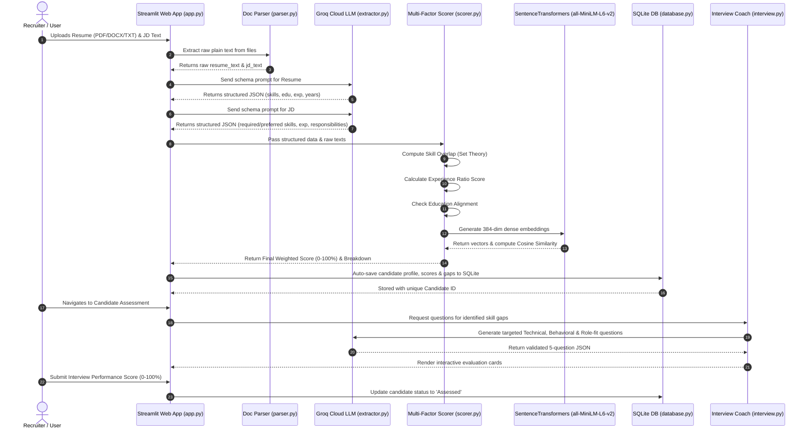

# 📘 HALO AI Recruitment Platform — How It Works

This guide details the internal mechanics, pipeline architecture, algorithmic scoring models, and data flows of the **HALO AI Resume Analyzer & Screening Platform**.

---

## 🔄 End-to-End Processing Pipeline



---

## 🧩 Step-by-Step Module Walkthrough

### 1. Document Ingestion (`parser.py`)
- **PDF Extraction**: Uses `pdfplumber` to iterate through pages, extracting text blocks while filtering out empty or image-only pages.
- **DOCX Extraction**: Uses `python-docx` to extract text from XML paragraph trees and tables.
- **Plain Text Extraction**: Reads raw byte buffers with automatic decoding fallback across `utf-8`, `utf-16`, `latin-1`, and `cp1252`.

```python
# Function signature in parser.py
extract_text(uploaded_file: UploadedFile | io.BytesIO | str) -> str
```

---

### 2. LLM-Powered Entity Extraction (`extractor.py`)
Raw text is fed to Groq-hosted open-weights models (`openai/gpt-oss-120b` or `llama-3.3-70b-versatile`) with strict few-shot JSON schema enforcement.

#### Resume JSON Schema:
```json
{
  "skills": ["Python", "React", "Docker", "SQL"],
  "education": [
    {
      "degree": "B.S. in Computer Science",
      "institution": "University of Technology",
      "year": "2021"
    }
  ],
  "experience": [
    {
      "title": "Software Engineer",
      "company": "Tech Corp",
      "duration": "3 years",
      "description": "Architected REST APIs and microservices"
    }
  ],
  "total_years_experience": 3.0
}
```

#### Job Description JSON Schema:
```json
{
  "required_skills": ["Python", "Docker", "Kubernetes"],
  "preferred_skills": ["GraphQL", "AWS"],
  "required_experience_years": 3.0,
  "education_requirement": "Bachelor in Computer Science",
  "key_responsibilities": ["Deploy cloud native services", "Maintain CI/CD"]
}
```

---

### 3. Multi-Factor Scoring Engine (`scorer.py`)

The overall score is computed as a weighted combination of **4 distinct dimensions**:

$$\text{Final Score} = (\text{Skill} \times 0.50) + (\text{Experience} \times 0.25) + (\text{Education} \times 0.15) + (\text{Semantic} \times 0.10)$$

#### A. Skill Match ($50\%$ Weight)
Normalizes all skills to lowercase and applies set operations:
- $\text{Matched} = \text{Resume Skills} \cap (\text{Required} \cup \text{Preferred})$
- $\text{Missing Required} = \text{Required} \setminus \text{Resume Skills}$
- $\text{Missing Preferred} = \text{Preferred} \setminus \text{Resume Skills}$
- $\text{Skill Score} = \left( \frac{|\text{Matched} \cap \text{Required}|}{|\text{Required}|} \right) \times 100$

#### B. Experience Alignment ($25\%$ Weight)
Evaluates candidate total years against the minimum required threshold:
$$\text{Experience Score} = \min\left(\frac{\text{Candidate Years}}{\text{Required Years}}, 1.0\right) \times 100$$
*(If 0 years are required, returns 100%).*

#### C. Education Alignment ($15\%$ Weight)
Matches candidate degree titles and fields against the job's requirement string:
- **100%**: Exact or partial substring match in degree title.
- **50%**: Candidate possesses degree entries, but different specialization.
- **40%**: No education entries detected.

#### D. Semantic Vector Similarity ($10\%$ Weight)
Computes dense vector representations of the raw resume text and job description using the `all-MiniLM-L6-v2` transformer model (384 dimensions) and calculates cosine similarity:
$$\text{Cosine Similarity} = \frac{\mathbf{u} \cdot \mathbf{v}}{\|\mathbf{u}\|_2 \|\mathbf{v}\|_2} \times 100$$

---

### 4. AI Mock Interview & Assessment Studio (`interview.py`)
Generates 5 tailored questions specifically targeting identified candidate weaknesses:
- **Technical Questions (2-3)**: Probing missing required tools or testing depth in matched skills.
- **Behavioral Questions (1-2)**: Evaluates past teamwork, conflict resolution, and leadership.
- **Role-Fit Questions (1)**: Evaluates alignment with day-to-day job responsibilities.

Each question returns an evaluation criterion (`tests` field) indicating what the interviewer should listen for.

---

### 5. Persistent Candidate Pipeline Database (`database.py`)
Stores records in local SQLite database (`candidates.db`):
- **Candidate Metadata**: Name, target role, years of experience, education.
- **Score Breakdown**: Final score, skill score, experience score, education score, semantic similarity.
- **Skill Gaps**: Serialized JSON array of missing required/preferred skills.
- **Assessment Tracking**: Interview performance percentage and lifecycle status (`Screened` $\rightarrow$ `Assessed`).

---

### 6. Interactive Executive Dashboard (`app.py`)
- **Top 5 KPI Metrics**: Live aggregation of active pipeline count, screening average, assessment rate, interview average, and total flagged skill gaps.
- **Cohort Analytics & Distribution Models**:
  - Score distribution histogram.
  - Frequent skill gap Pareto ranking.
  - Resume match vs. interview performance correlation scatter plot.
- **Recruiter Database**: Searchable, filterable candidate repository with CSV export.
- **Head-to-Head Comparison**: Multi-candidate radar chart overlay.
