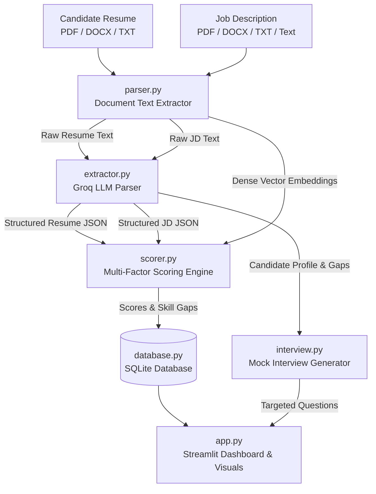

# 📄 HALO AI Resume Analyzer & Matcher

[](https://www.python.org/)
[](https://streamlit.io/)
[](https://groq.com/)
[](https://huggingface.co/sentence-transformers/all-MiniLM-L6-v2)
[](LICENSE)

An intelligent, full-stack recruitment intelligence platform that analyzes candidate resumes against job descriptions (JDs) in real time. It delivers weighted multi-factor match scoring, deep skill gap analytics, interactive cohort distributions, and AI-generated mock interview questions tailored to the candidate's exact profile gaps.

---

## 📚 In-Depth Documentation

- 🛠️ **[Technology Stack Details (TECHSTACK.md)](TECHSTACK.md)**: Deep breakdown of all libraries, frameworks, machine learning models, database schema, and runtime dependencies.
- 📘 **[Architecture & How It Works (HOW_IT_WORKS.md)](HOW_IT_WORKS.md)**: Complete step-by-step pipeline, sequence diagrams, and mathematical scoring formulas.

---

## 🌟 Key Features

- **Multi-Format Document Parsing**: Seamlessly extracts text from **PDF** (via `pdfplumber`), **DOCX** (via `python-docx`), and plain **TXT** files, or accepts direct copy-pasted job descriptions.
- **LLM-Powered Entity Extraction**: Uses Groq-hosted open-weights models (`gpt-oss-120b`, `llama-3.3-70b-versatile`) to reliably parse unstructured resumes and JDs into validated JSON schemas.
- **Multi-Factor Weighted Match Scoring**:
  - 🛠️ **Skill Match (50%)**: Exact & normalized comparison against required and preferred skills.
  - 💼 **Experience Alignment (25%)**: Ratio of candidate's total years of experience against job requirements.
  - 🎓 **Education Alignment (15%)**: Qualification, degree, and specialization relevance scoring.
  - 🧠 **Semantic Similarity (10%)**: Dense vector cosine similarity computed using HuggingFace's `all-MiniLM-L6-v2` embeddings.
- **Interactive Visual Dashboard**:
  - Top 5 KPI Summary Cards (Total Candidates, Average Match %, Assessment Rate, Avg Assessment Score, Total Skill Gaps Flagged).
  - Plotly interactive charts: Match Score Distribution Histogram, Most Frequent Skill Gaps Bar Chart, and Resume Match vs. Assessment Score Scatter Plot.
  - 6 Platform Navigation views (`Dashboard`, `Resume Analyzer`, `Candidate Assessment`, `Recruiter Database`, `Reports & Comparison`, `Settings`).
- **Dynamic AI Mock Interview Generator**: Generates 5 tailored interview questions (Technical, Behavioral, and Role-Fit) with specific evaluation criteria addressing the candidate's detected weaknesses.

---

## 🏗️ System Architecture



---

## 🧮 Scoring Formula Breakdown

$$\text{Final Score} = (S \times 0.50) + (E \times 0.25) + (D \times 0.15) + (M \times 0.10)$$

| Dimension | Weight | Description |
| :--- | :---: | :--- |
| **Skill Match ($S$)** | **50%** | Percentage of mandatory required skills satisfied by the candidate. |
| **Experience ($E$)** | **25%** | Candidate years of experience relative to minimum required years (capped at 100%). |
| **Education ($D$)** | **15%** | Degree alignment against specified qualifications (100% exact match, 50% partial degree). |
| **Semantic Similarity ($M$)** | **10%** | Cosine similarity between resume and JD sentence embeddings. |

---

## 📁 Project Directory Structure

```text
├── .streamlit/
│   ├── secrets.toml            # Private API keys (git-ignored)
│   └── secrets.toml.example    # Configuration template for secrets
├── tests/
│   ├── __init__.py             # Unit test package initializer
│   ├── test_parser.py          # Document text extraction unit tests
│   └── test_scorer.py          # Skill overlap and scoring unit tests
├── .env.example                # Environment variable configuration template
├── .gitignore                  # Git ignore rules for virtualenvs, cache, and secrets
├── app.py                      # Main Streamlit web application & UI dashboard
├── database.py                 # SQLite database storage layer & candidate pipeline
├── extractor.py                # Groq LLM structured JSON entity extractor
├── interview.py                # AI tailored mock interview generator
├── parser.py                   # PDF, DOCX, and TXT document parser
├── requirements.txt            # Python package dependencies
├── scorer.py                   # Weighted multi-factor candidate scoring engine
├── HOW_IT_WORKS.md             # Complete architecture, pipeline & formula documentation
├── TECHSTACK.md                # Comprehensive technology stack reference
└── README.md                   # Main project overview & user guide
```

---

## 🚀 Quickstart & User Guide

### 1. Prerequisites
- **Python**: Version `3.10` or higher
- **Groq API Key**: Obtain a free API key from [Groq Console](https://console.groq.com/keys)

---

### 2. Installation & Setup

#### Step 1: Navigate to the Project Directory
```bash
cd path/to/PythonProject5
```

#### Step 2: Create and Activate a Virtual Environment
- **Windows (PowerShell):**
  ```powershell
  python -m venv .venv
  .\.venv\Scripts\Activate.ps1
  ```
- **macOS / Linux:**
  ```bash
  python3 -m venv .venv
  source .venv/bin/activate
  ```

#### Step 3: Install Dependencies
```bash
pip install --upgrade pip
pip install -r requirements.txt
```

---

### 3. API Key Configuration

Create a `.streamlit/secrets.toml` file from the provided template:

**Windows PowerShell:**
```powershell
Copy-Item .streamlit/secrets.toml.example .streamlit/secrets.toml
```

**macOS / Linux:**
```bash
cp .streamlit/secrets.toml.example .streamlit/secrets.toml
```

Edit `.streamlit/secrets.toml` with your Groq API key:
```toml
GROQ_API_KEY = "gsk_your_actual_groq_api_key_here"
```

---

### 4. Running the Application (Terminal Commands)

#### Standard Local Execution
Run the following terminal command in your project root:
```bash
streamlit run app.py
```
> The application will start and automatically open in your default browser at **`http://localhost:8501`**.

#### Run on a Custom Port
```bash
streamlit run app.py --server.port 8080
```

#### Run in Headless Mode (For Cloud VMs)
```bash
streamlit run app.py --server.headless true --server.port 8501
```

---

### 5. Running Automated Unit Tests

Run the test suite to verify scoring mechanics and document extraction:
```bash
python -m unittest discover -s tests -p "test_*.py"
```

---

## 🛠️ Step-by-Step GitHub Setup & Push Guide

```bash
# 1. Initialize git repository
git init

# 2. Stage all files
git add .

# 3. Commit changes
git commit -m "feat: complete HALO recruitment platform with docs and light theme"

# 4. Link to your GitHub repository
git branch -M main
git remote add origin https://github.com/<YOUR_GITHUB_USERNAME>/<YOUR_REPO_NAME>.git

# 5. Push code to GitHub
git push -u origin main
```

---

## 📄 License

This project is licensed under the **MIT License**. See the [LICENSE](LICENSE) file for details.
